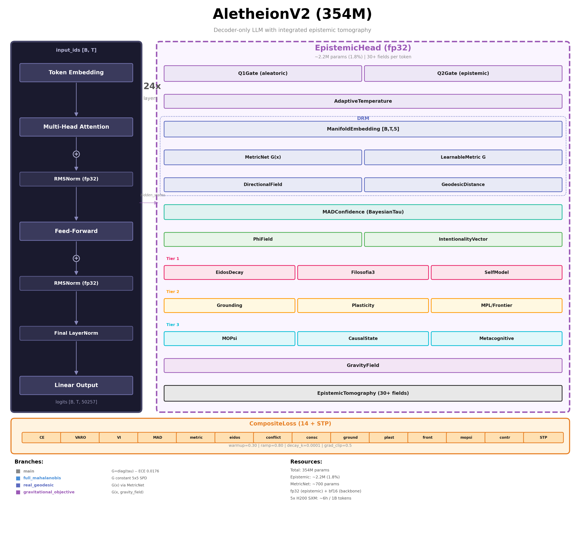

# Aletheion LLM v2

[](https://www.gnu.org/licenses/agpl-3.0)
[](https://www.python.org/)
[](https://pytorch.org/)
[](https://doi.org/10.13140/RG.2.2.11471.14241)
[](#calibration-results)
[](#calibration-results)
[](#architecture)
[](#testes)

Decoder-only LLM com sistema epistemico integrado como `nn.Module` treinaveis.
Cada token produz uma **tomografia epistemica** completa no manifold Riemanniano 5D.

**354M params** | **261 testes** | **15 configs (1M-640B)** | **Continual Learning (EWC + Replay)** | **AGPL-3.0**

## Architecture



---

## Branch: main

**Status:** Complete
**Result:** ECE 0.0176, Brier Score 0.1528, best-in-class on OOD WikiText-103 vs GPT-2 Medium and OPT-350M.
**Geometry:** Flat, orthogonal axes. G = diag(tau). Riemannian curvature = 0.

### Hypothesis
- H0: Diagonal metric is insufficient -- axes are correlated or space is curved
- H1: Diagonal metric captures sufficient epistemic structure
- **Outcome: H1 confirmed empirically.**

### Experimental Sequence
This branch is the baseline for the following experimental sequence:
1. `main` (this branch) -- diagonal metric baseline
2. `full_mahalanobis` -- constant off-diagonal G, tests axis correlation
3. `real_geodesic` -- position-dependent G(x), tests Riemannian curvature
4. `gravitational_objective` -- G(x) conditioned on value feedback field

---

## Indice

- [Visao Geral](#visao-geral)
- [Arquitetura](#arquitetura)
- [Modulos Neurais (11 heads)](#modulos-neurais-11-heads)
- [Tomografia Epistemica](#tomografia-epistemica)
- [Manifold DRM 5D](#manifold-drm-5d)
- [Instalacao](#instalacao)
- [Quick Start](#quick-start)
- [Testes](#testes)
- [Treinamento](#treinamento)
- [Configs de Escala](#configs-de-escala)
- [Loss Composta (14 componentes)](#loss-composta-14-componentes)
- [Continual Learning](#continual-learning)
- [Geracao com Tomografia](#geracao-com-tomografia)
- [Estrutura do Projeto](#estrutura-do-projeto)
- [Papers](#papers)
- [Licenca](#licenca)

---

## Visao Geral

O AletheionV2 e um LLM decoder-only onde o sistema epistemico nao e um
pos-processamento externo, mas sim parte integrante da rede neural. Todos os
11 sub-heads sao `nn.Module` treinaveis, com gradientes fluindo end-to-end
atraves de 14 funcoes de perda com schedule de annealing.

Diferente de LLMs tradicionais que produzem apenas logits, cada token gera
uma **tomografia epistemica** com 30+ campos: incerteza (Q1/Q2), confianca
MAD, posicao no manifold 5D, saude estrutural (phi), vetor de intencionalidade,
estado cognitivo (mood, energia, drives) e mais.

### Diferenciais

- **Epistemico intrinseco**: Q1 (aleatoria) e Q2 (epistemica) como gates treinaveis
- **Manifold Riemanniano 5D**: tensor metrico SPD, geodesicas, curvatura de Ricci
- **MPC (Model Predictive Control)**: beam search no manifold com 12 acoes
- **Continual Learning nativo**: EWC + Experience Replay integrados no trainer
- **Escalavel**: configs de 1M a 640B parametros, DDP/FSDP para multi-GPU

---

## Arquitetura

```
input_ids -> Embeddings (RoPE) -> TransformerBlock x N -> ln_final
                                                           |
                                              +------------+-----------+
                                              |                        |
                                          lm_head                EpistemicHead
                                          (tied)                (11 sub-heads)
                                              |                        |
                                          logits        EpistemicTomography (30+ campos)
                                         [B,T,V]                      |
                                          +----+----+----+----+----+----+----+
                                          |    |    |    |    |    |    |    |
                                         DRM  MAD  VI  MPC Eidos Phil SelfM ...
```

### Forward Pass

1. **Embeddings**: token lookup + RoPE (rotary position encoding)
2. **Transformer Blocks** (x N): pre-norm, multi-head attention com mascara causal, SwiGLU feed-forward, conexoes residuais
3. **Saida dual**:
   - `lm_head` (weight-tied com embeddings) -> logits
   - `EpistemicHead` (11 sub-heads em 3 tiers) -> tomografia por token

---

## Modulos Neurais (11 heads)

### Core

| Modulo | Params | Descricao |
|--------|--------|-----------|
| DRM Manifold | ~50K | Coordenadas 5D + tensor metrico SPD + campo direcional + geodesicas |
| MAD Confidence | ~2K | Confianca Bayesiana com tau^2 aprendivel (InverseGamma prior) |
| VI (Intentionality) | ~5K | Saude do manifold phi(M) com 4 componentes + correcao de confianca |
| MPC Navigator | ~1K | Controle preditivo com beam search (K=4, D=3), 12 acoes |

### Tier 1 (~1.7K params)

| Modulo | Params | Descricao |
|--------|--------|-----------|
| EidosDecay | ~368 | Balanceamento de eixos 5D (decay invertido + reinforce) |
| Filosofia3 | ~373 | Deteccao de conflito phi-psi (cosine similarity) |
| SelfModel | ~982 | Humor, curiosidade, energia, drives motivacionais |

### Tier 2 (~112K params)

| Modulo | Params | Descricao |
|--------|--------|-----------|
| TaskHead | ~50K | Classificacao de tarefas (9 tipos) |
| AmbiguityHead | ~50K | Deteccao de ambiguidade |
| PlasticityGate | ~12K | Gate de plasticidade sinaptica com deplecao |
| FrontierHead | ~129 | Exploracao de fronteira no manifold (scoring) |

### Tier 3 (~250K params)

| Modulo | Params | Descricao |
|--------|--------|-----------|
| MOPsi | ~25K | Estado humano 5D + mediacao phi-psi |
| CausalState | ~26K | Condicionamento causal + policy binding |
| Metacognitive | ~200K | Auto-avaliacao contrastiva dual (anti-colapso) |

---

## Tomografia Epistemica

Cada token produz um `EpistemicTomography` com os seguintes campos:

| Campo | Shape | Descricao |
|-------|-------|-----------|
| q1 | [B,T,1] | Incerteza aleatoria (irredutivel) |
| q2 | [B,T,1] | Incerteza epistemica (redutivel) |
| confidence | [B,T,1] | Confianca MAD (Gaussiana com tau Bayesiano) |
| drm_coords | [B,T,5] | Coordenadas no manifold Riemanniano 5D |
| metric_tensor | [5,5] | Tensor metrico SPD (define geometria) |
| phi_total | [B,T,1] | Saude do manifold (4 componentes ponderados) |
| vi_direction | [B,T,5] | Vetor de correcao de intencionalidade |
| vi_severity | [B,T,1] | Intensidade da correcao (sqrt curve) |
| temperature | [B,T,1] | Temperatura adaptativa (f(Q1,Q2)) |
| +20 campos opcionais | ... | eidos, conflito, mood, drives, task, ambiguity, etc. |

---

## Manifold DRM 5D

O modelo opera num manifold Riemanniano 5D onde cada token e mapeado via MLP:

```
hidden [B,T,d_model] -> MLP -> coords [B,T,5] in [0,1]^5
```

As 5 dimensoes capturam aspectos epistemicos distintos:

| Dim | Aspecto |
|-----|---------|
| 0 | Certeza factual |
| 1 | Consistencia logica |
| 2 | Contexto / grounding |
| 3 | Calibracao de confianca |
| 4 | Profundidade epistemica |

O tensor metrico G[5,5] (SPD) define:
- **Distancias geodesicas** entre tokens
- **Curvatura de Ricci** (saude estrutural do manifold)
- **Direcoes preferenciais** de exploracao

---

## Instalacao

### Requisitos

- Python >= 3.10
- PyTorch >= 2.1.0

### CPU

```bash
pip install -e ".[dev]"
```

### GPU (CUDA 12.4)

```bash
pip install torch --index-url https://download.pytorch.org/whl/cu124
pip install -e ".[dev,data]"
```

### Dependencias opcionais

- `dev`: pytest, pytest-cov (testes)
- `data`: datasets, tiktoken (preparacao de dados e tokenizacao)

---

## Quick Start

```python
import torch
from aletheion_v2 import AletheionV2Config, AletheionV2Model

# Criar modelo com config padrao (125M)
config = AletheionV2Config()
model = AletheionV2Model(config)

# Forward pass
input_ids = torch.randint(0, config.vocab_size, (1, 128))
output = model(input_ids)

# Logits padrao
logits = output.logits  # [1, 128, 32000]

# Tomografia epistemica por token
tomo = output.epistemic
print(f"Q1: {tomo.q1.shape}")           # [1, 128, 1]
print(f"Q2: {tomo.q2.shape}")           # [1, 128, 1]
print(f"Confidence: {tomo.confidence.mean():.4f}")
print(f"DRM coords: {tomo.drm_coords.shape}")  # [1, 128, 5]
print(f"Phi (saude): {tomo.phi_total.mean():.4f}")
```

---

## Testes

```bash
# Todos os 261 testes
pytest tests/ -v

# Suites individuais
pytest tests/test_model.py -v              # Modelo core (7 testes)
pytest tests/test_epistemic.py -v          # Sistema epistemico (12 testes)
pytest tests/test_drm.py -v               # Manifold DRM (8 testes)
pytest tests/test_vi.py -v                # VI + MAD + Bayesian tau (13 testes)
pytest tests/test_continual_learning.py -v # EWC + Replay (51 testes)
pytest tests/test_integration.py -v        # End-to-end (15 testes)
```

### Cobertura por suite

| Suite | Testes | Cobertura |
|-------|--------|-----------|
| test_model | 7 | Forward, backward, causal mask, weight tying |
| test_epistemic | 12 | Q1/Q2 gates, temperatura, EpistemicHead |
| test_drm | 8 | Manifold, metrica, geodesicas |
| test_vi | 13 | Phi field, VI, Bayesian tau, MAD |
| test_eidos | 10 | EidosDecay + loss |
| test_filosofia3 | 10 | Conflito phi-psi + loss |
| test_consciousness | 10 | SelfModel + loss |
| test_grounding | 15 | TaskHead + AmbiguityHead + loss |
| test_plasticity | 10 | PlasticityGate + loss |
| test_mpl | 15 | DensityTracker + FrontierHead + loss |
| test_mopsi | 12 | HumanState + Mediator + loss |
| test_causal_state | 10 | StateConditioning + PolicyBinding |
| test_metacognitive | 12 | ContrastiveHead + loss |
| test_continual_learning | 51 | EWC + Replay + configs YAML |
| test_integration | 15 | End-to-end + MPC + data pipeline |

---

## Treinamento

### Opcao 1: Script interativo (Windows PowerShell)

```powershell
# Setup completo interativo
.\train.ps1

# Passos individuais
.\train.ps1 -Step setup      # So instala dependencias
.\train.ps1 -Step data       # So prepara dados
.\train.ps1 -Step train      # So treina (assume tudo pronto)

# Teste rapido com TinyStories
.\train.ps1 -TestData

# Resume de checkpoint
.\train.ps1 -Step train -Resume checkpoints/350m_rtx4090/step_5000.pt
```

### Opcao 2: Scripts diretos (Linux/Mac/Windows)

```bash
# 1. Preparar dados
python scripts/prepare_data.py \
    --dataset fineweb-edu \
    --subset sample-10BT \
    --output data/350m

# 2. Treinar (single GPU)
python scripts/train_distributed.py \
    --config configs/scaling/350m_rtx4090.yaml \
    --data-dir data/350m

# 3. Visualizar metricas
python scripts/plot_training.py \
    --log checkpoints/350m_rtx4090/training_log.json
```

### Opcao 3: Multi-GPU (DDP/FSDP)

```bash
# 4 GPUs com DDP
torchrun --nproc_per_node=4 scripts/train_distributed.py \
    --config configs/scaling/7b.yaml \
    --data-dir data/7b

# 8 GPUs com FSDP (modelos grandes)
torchrun --nproc_per_node=8 scripts/train_distributed.py \
    --config configs/scaling/13b.yaml \
    --data-dir data/13b \
    --strategy fsdp
```

---

## Configs de Escala

15 configuracoes pre-definidas em `configs/scaling/`:

| Config | Params | d_model | n_heads | n_layers | VRAM | Hardware |
|--------|--------|---------|---------|----------|------|----------|
| 1m | ~2M | 64 | 2 | 4 | <1 GB | CPU |
| 10m | ~13M | 256 | 4 | 6 | <1 GB | CPU/GPU |
| 50m | ~42M | 512 | 8 | 8 | ~2 GB | 1x GPU |
| 125m | ~110M | 768 | 12 | 12 | ~4 GB | 1x GPU |
| **350m** | **354M** | **1024** | **16** | **24** | **~8 GB** | **1x RTX 4090** |
| 1.3b | ~1.3B | 2048 | 16 | 24 | ~20 GB | 1x A100 |
| 7b | ~6.6B | 4096 | 32 | 32 | ~80 GB | 4x A100 |
| 13b | ~13B | 5120 | 40 | 40 | ~160 GB | 8x A100 |
| 30b | ~30B | 6656 | 52 | 60 | ~360 GB | 16x A100 |
| 70b | ~70B | 8192 | 64 | 80 | ~840 GB | 32x A100 |
| 162b | ~162B | 12288 | 96 | 96 | ~2 TB | 64x A100 |
| 250b | ~258B | 16384 | 128 | 80 | ~3 TB | 128x H100 |
| 400b | ~391B | 18432 | 144 | 96 | ~5 TB | 256x H100 |
| 640b | ~644B | 20480 | 160 | 128 | ~8 TB | 512x H100 |

**Padroes de escalamento:**
- `head_dim`: 32 (1M), 64 (10M-350M), 128 (1.3B+)
- `d_ff`: 4 * d_model (padrao) ou SwiGLU (7B+)
- Gradient checkpointing a partir de 1.3B
- FSDP a partir de 7B
- Dropout 0.0 a partir de 7B

Carregar uma config:

```python
config = AletheionV2Config.from_yaml("configs/scaling/350m_rtx4090.yaml")
```

---

## Loss Composta (14 componentes)

```
L = CE + anneal * (VARO + VI + MAD + metric_reg
                 + eidos + conflict + consciousness
                 + grounding + plasticity + frontier
                 + mopsi + contrastive + stp)
```

| Componente | Objetivo |
|------------|----------|
| CE | Cross-entropy padrao (next-token prediction) |
| VARO | Variancia condicional Q1*Q2 |
| VI | Regularizacao phi(M) minimo |
| MAD | Calibracao confianca vs acuracia |
| metric_reg | Condition number do tensor metrico G |
| eidos | Balanceamento dos 5 eixos |
| conflict | Penaliza conflito phi-psi |
| consciousness | Energia minima do self-model |
| grounding | Entropia + calibracao ambiguidade |
| plasticity | Plasticidade minima |
| frontier | Maximiza exploracao de fronteira |
| mopsi | Alinhamento psi-confianca |
| contrastive | Anti-colapso contrastivo dual |
| stp | Smooth Transition Penalty - suavidade de trajetoria no espaco latente |

**Annealing schedule:**
- Steps 0 - 10%: `anneal = 0` (somente CE)
- Steps 10% - 50%: `anneal` cresce linearmente de 0 a 1
- Steps 50% - 100%: `anneal = 1` (todas as losses ativas)

---

## Continual Learning

### EWC (Elastic Weight Consolidation)

Apos cada fase de treinamento, computa a Fisher Information Matrix diagonal:

```
F_i = E[ (dL/d_theta_i)^2 ]    # Importancia do parametro i
```

Na fase seguinte, adiciona penalidade proporcional:

```
L_ewc = (lambda/2) * sum_i F_i * (theta_i - theta*_i)^2
```

### Experience Replay

Reservoir sampling mantem buffer de amostras anteriores em CPU.
Durante treinamento, substitui `mix_ratio` (default 10%) do batch com amostras do buffer.

### Exemplo

```python
from aletheion_v2.config import AletheionV2Config
from aletheion_v2.core.model import AletheionV2Model
from aletheion_v2.training.trainer import Trainer

config = AletheionV2Config.from_yaml("configs/scaling/350m_rtx4090.yaml")
model = AletheionV2Model(config)
trainer = Trainer(model, config, train_loader, device="cuda")

# Fase 1
trainer.train()
trainer.consolidate_phase()  # Computa Fisher Information Matrix

# Fase 2 (EWC protege conhecimento anterior)
trainer.train_loader = new_loader
trainer.train()
```

---

## Geracao com Tomografia

```python
from aletheion_v2 import AletheionV2Config, AletheionV2Model
from aletheion_v2.inference.generator import Generator
from aletheion_v2.inference.dashboard_bridge import DashboardBridge

config = AletheionV2Config.from_yaml("configs/scaling/350m_rtx4090.yaml")
model = AletheionV2Model(config)
gen = Generator(model, max_new_tokens=50, top_k=50, use_mpc=True)

result = gen.generate(input_ids)
# result.tomography_per_token: lista de EpistemicTomography
# result.avg_confidence, result.avg_phi

# Exportar para dashboard
bridge = DashboardBridge()
snapshot = bridge.from_generation_result(result)
print(bridge.to_json(snapshot))
```

---

## Estrutura do Projeto

```
aletheion-llm-v2/
|-- LICENSE                     # AGPL-3.0 (texto completo)
|-- LICENSE-COMMERCIAL.md       # Termos da licenca comercial
|-- CLA.md                      # Contributor License Agreement
|-- pyproject.toml              # Metadados, dependencias, config
|-- requirements.txt            # Dependencias (alternativo)
|-- train.ps1                   # Script interativo PowerShell
|-- ARCHITECTURE.md             # Arquitetura detalhada
|
|-- src/aletheion_v2/
|   |-- __init__.py
|   |-- config.py               # AletheionV2Config (50+ campos)
|   |
|   |-- core/                   # Nucleo do modelo
|   |   |-- model.py            # AletheionV2Model (forward principal)
|   |   |-- embeddings.py       # TokenEmbedding + RoPE
|   |   |-- transformer_block.py # TransformerBlock (attn + SwiGLU + ln)
|   |   +-- output.py           # ModelOutput + EpistemicTomography
|   |
|   |-- epistemic/              # Sistema epistemico central
|   |   |-- epistemic_head.py   # EpistemicHead (orquestra sub-heads)
|   |   +-- gates.py            # Q1Gate, Q2Gate, AdaptiveTemperature
|   |
|   |-- drm/                    # Directional Relational Manifold
|   |   |-- manifold_embedding.py # Coords 5D via MLP
|   |   |-- metric_tensor.py    # Tensor metrico SPD G[5,5]
|   |   |-- directional_field.py # Campo direcional (entropia atencao)
|   |   +-- geodesic_distance.py # Distancia geodesica
|   |
|   |-- mad/                    # Metric-Aware Distance
|   |   |-- bayesian_tau.py     # Tau^2 Bayesiano (InverseGamma)
|   |   +-- confidence.py       # Confianca MAD Gaussiana
|   |
|   |-- vi/                     # Vetor de Intencionalidade
|   |   |-- phi_field.py        # phi(M) = sum(w_i * phi_i)
|   |   +-- intentionality_vector.py # Severidade + correcao
|   |
|   |-- mpc/                    # Model Predictive Control
|   |   |-- transition_model.py # 12 acoes de transicao
|   |   +-- navigator.py        # Beam search (K=4, D=3)
|   |
|   |-- eidos/                  # Tier 1 - Balanceamento estrutural
|   |-- filosofia3/             # Tier 1 - Conflito phi-psi
|   |-- consciousness/          # Tier 1 - Auto-modelo
|   |-- grounding/              # Tier 2 - Task + Ambiguidade
|   |-- plasticity/             # Tier 2 - Plasticidade sinaptica
|   |-- mpl/                    # Tier 2 - Frontier scoring
|   |-- mopsi/                  # Tier 3 - Estado humano + mediacao
|   |-- causal_state/           # Tier 3 - Condicionamento causal
|   |-- metacognitive/          # Tier 3 - Contrastive head
|   |
|   |-- loss/                   # 14 funcoes de perda
|   |   |-- composite_loss.py   # Agregador com annealing
|   |   +-- *.py                # Uma loss por modulo
|   |
|   |-- training/               # Pipeline de treinamento
|   |   |-- trainer.py          # Single-GPU
|   |   |-- trainer_distributed.py # DDP/FSDP
|   |   |-- distributed.py     # Setup multi-GPU + mixed precision
|   |   |-- data.py            # Datasets sinteticos
|   |   |-- data_pipeline.py   # Memmap, HF streaming, mixing
|   |   |-- scheduler.py       # WarmupCosine + LossWeightAnnealer
|   |   |-- ewc.py             # Elastic Weight Consolidation
|   |   +-- replay_buffer.py   # Experience Replay (reservoir)
|   |
|   |-- inference/              # Geracao
|   |   |-- generator.py       # Generator (top-k, MPC opcional)
|   |   +-- dashboard_bridge.py # Ponte para dashboard
|   |
|   +-- tokenizer/              # Tokenizacao
|       +-- tokenizer.py       # tiktoken / sentencepiece wrapper
|
|-- tests/                      # 261 testes (15 suites)
|-- configs/scaling/            # 15 configs YAML (1M - 640B)
|-- scripts/                    # Preparacao de dados, treinamento, plots
|-- paper/                      # Papers LaTeX (en/ e pt/)
|-- plots/                      # Graficos de treinamento e comparacao
|-- checkpoints/                # Checkpoints de modelos treinados
|-- data/                       # Datasets de treinamento
+-- docs/process/               # Documentacao de processos (auditoria)
```

---

## Origem e Autoria Intelectual

Os conceitos epistemicos implementados neste modelo foram **criados e desenvolvidos
originalmente por Felipe Maya Muniz** no projeto ATIC (Adaptive Turing Intelligent
Cognition), onde existem como modulos Python no pipeline de orquestracao:

| Conceito | Descricao Original | Origem |
|----------|--------------------|--------|
| **DRM (Directional Relational Manifold)** | Manifold Riemanniano 5D para modelagem epistemica | ATIC v2.0+ (2025) |
| **MAD (Metric-Aware Distance)** | Confianca Bayesiana com tau^2 e decaimento Gaussiano | ATIC v2.0+ (2025) |
| **VI (Vetor de Intencionalidade)** | Monitoramento e correcao homestatica do manifold via phi(M) | ATIC v2.5+ (2025) |
| **MPC Navigator** | Controle preditivo com beam search no manifold epistemico | ATIC v3.0+ (2025) |
| **MOPsi (Modulo Orientador de Psi)** | Estado humano 5D + mediacao phi-psi | ATIC v3.0+ (2025) |
| **MPL (Modulo Projetor de Longo Prazo)** | Density tracking + frontier exploration | ATIC v3.0+ (2025) |
| **EidosDecay** | Decay invertido + dream cycles para balanceamento de eixos | ATIC v2.5+ (2025) |
| **Filosofia3** | Conflito phi-psi negociado | ATIC v3.0+ (2025) |
| **SelfModel** | Modelo de consciencia com mood, curiosidade, energia, drives | ATIC v2.0+ (2025) |
| **Termodinamica Computacional** | Custo de Landauer, plasticidade, dinamicas irreversiveis | ATIC v3.0+ (2025) |
| **Tomografia Epistemica** | Analise multi-dimensional por token com 30+ campos | ATIC v2.0+ (2025) |

No ATIC, estes conceitos operam como calculos Python no pipeline de pos-processamento.
No AletheionV2, sao **transpostos para nn.Modules treinaveis** dentro da rede neural,
permitindo que a epistemica seja aprendida end-to-end e influencie diretamente a geracao.

Esta transposicao de orquestracao-em-Python para modulos-neurais-treinaveis e a
contribuicao central deste trabalho.

---

## References
- AletheionV2: https://doi.org/10.13140/RG.2.2.11471.14241
- DRM: https://doi.org/10.5281/zenodo.19058837
- ATIC: https://doi.org/10.5281/zenodo.19058926

---

## Papers

O artigo descrevendo a arquitetura e fundamentacao teorica esta disponivel em:

- `paper/en/` - Versao em ingles
- `paper/pt/` - Versao em portugues

---

## Licenca

Este projeto usa **licenciamento dual**:

### AGPL-3.0 (open-source)

O codigo esta licenciado sob [GNU Affero General Public License v3.0](LICENSE).
Voce pode usar, modificar e redistribuir livremente, desde que cumpra os termos
da AGPL (incluindo disponibilizar codigo-fonte de versoes modificadas usadas
em rede).

### Licenca Comercial

Para uso em projetos proprietarios, SaaS sem obrigacao de abrir codigo, ou
redistribuicao sem copyleft, uma [licenca comercial](LICENSE-COMMERCIAL.md)
esta disponivel.

Contato: felipe@truthagi.ai

### Contribuicoes

Contribuicoes externas requerem assinatura do [CLA](CLA.md) para manter a
viabilidade do licenciamento dual.

---

Copyright (C) 2025-2026 Felipe Maya Muniz
